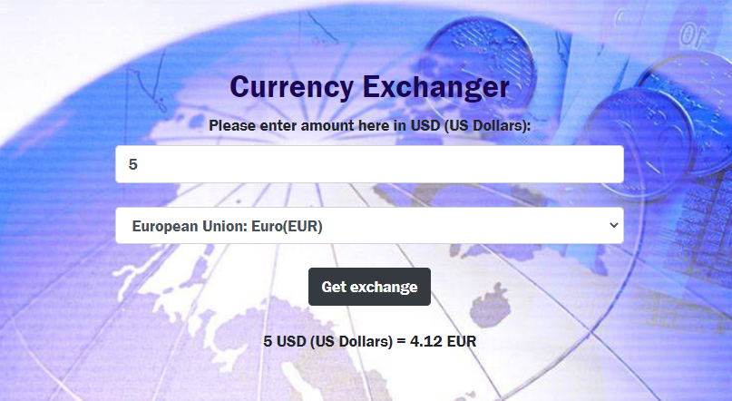

# **Currency Exchanger**
By _Olha Hizhytska_

Using this application user can type in an amount (in U.S. dollars) and then choose which currency it should be converted to (such as Ukrainian Hryvnia, Euro, Canadian Dollar, Armenian Dram, New Zealand Dollar). To determine the most recent exchange rate, this application will make an API call to the following [exchange rate API](https://www.exchangerate-api.com/). Then the user will be able to see the total amount they entered in the converted currency.

## Description

This application demonstrates:
-  practicing making API calls using fetch method. 
- creating modern development environments, using module bundling with Webpack, dependencies are managed using npm.
- using error handling and displaying errors in the DOM in case of server error, empty input fields and not available currency to convert.
- working with environment variable, storing API keys in it. 
- correctly parsing data from an API response

 
## Setup

- Clone this repository to your desktop, using next command:

  git clone https://github.com/OlgaHi/Currency-Exchanger.git

- Navigate to the top level of the directory.

  cd Currency-Exchanger

- Open in text editor to view code:
  -  Run the command `npm run install` to install dev dependencies

  - Run the command `npm run start` to open in a local server

- To be able to use this application you will need to use your own API key.
  - Steps to follow:
     - go to [ExchangeRate API site](https://www.exchangerate-api.com/) and set up a developer account, by inputting your email address and clicking the "Get FREE Key" button.
     - please fill the form with your email, first name and password. Accept terms of use and click "Get Started!"
     - you will see in a dashboard your API key.
     - create file .env in the top level of the directory.
     - add your key into the .env file using variable: API_KEY=[your API key] (without spacing).
     - in a .gitignore file add .env file.

## Technologies Used:

* JavaScript
* HTML/CSS/Bootstrap
* jQuery
* Node
* Npm
* Webpack
* [ExchangeRate-API](https://www.exchangerate-api.com/)

## Known Bugs

- No known issues

## License

[MIT](https://en.wikipedia.org/wiki/MIT_License)
Copyright (c) 2021 _Olha Hizhytska_

## Contact Information

- Olha Hizhytska olgainfotech@gmail.com
